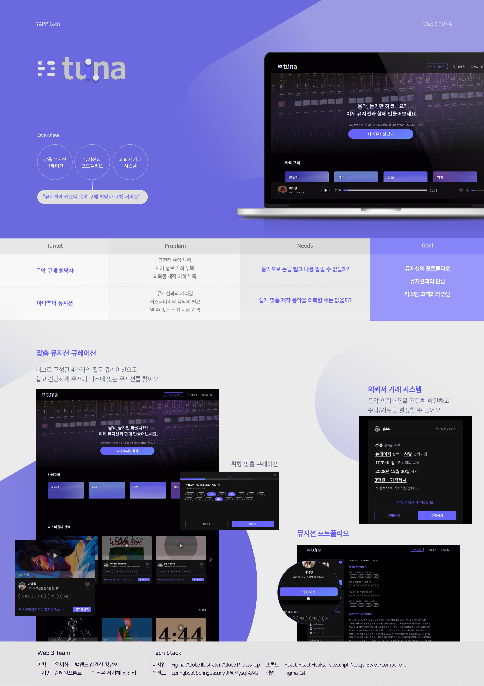

# [기업형 IT 연합동아리 YAPP 16th](http://yapp.co.kr/)

## 🐟 뮤지션이 유저의 요구사항에 따라 원하는 대로 음원을 만들어주는 개인 맞춤 서비스

## 개발 기능

- 도메인 모델, 테이블 설계, 서비스, 레포지토리 설계 (유저, 뮤지션, 카테고리, 소셜로그인)
- TUNA JPA 엔티티 설계
- 뮤지션 조회, 등록, 검색 API 
- 유저 조회 등록 API
- 카테고리 API
- AWS S3 음원 파일 업로드 기능
- JUnit4를 통한 단위 테스트

## BACKE-END
### 개발환경
* Java 8  
* SpringBoot 2  
* JPA(Hibernate)
* AWS RDS(Mysql)
* Spring Data JPA  
* Spring Security
* AWS EC2 S3

## ER-DIAGRAM

